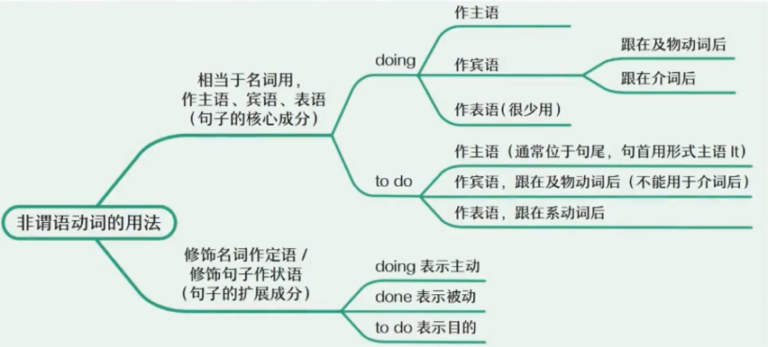

# Simple Sentence

## Enhancement

### 非谓语动词作状语、定语

- 非谓语动词在句子中既可以**修饰名词**作定语，也可以修饰句子做状语
- 三种非谓语动词在修饰时表达的意思不同
    1. done: 表示**被动**。可加 by 引出的介词短语，用于强调动作的发出者，即"被谁做"
    2. doing: 表示**主动**。如果是及物动词，要后接宾语；表示进一步的修饰，还可加入形容词、副词和介词短语
    3. to do: 表示**目的**。如果是及物动词，要后接宾语；表示进一步的修饰，还可加入形容词、副词和介词短语
- 注意非谓语动词词组的完整性
    1. 如果是**及物动词，要后接宾语**
    2. 可以加入解释说明、修饰限定的形容词、副词和介词短语
- 使用非谓语动词步骤
    1. 是否要用非谓语 == 是否已经有主谓
    2. 判断修饰谁
    3. 判断主动、被动、目的
- **问：如何区分非谓语动词作定语还是状语？怎么判断修饰的是名词还是句子？**
    - 判断 1：看位置 + 所修饰词
        - 紧跟名词/代词后面 → 多半是定语
        - 放在句子开头/结尾，和整个句子搭配 → 多半是状语
    - 判断 2：问“它回答的问题”
        - 如果它回答的是 “哪个/什么样的名词？” → 定语。
            - Students to take the exam must sign up before Friday.
            - → 回答“哪些学生？” → 定语。
        - 如果它回答的是 “为什么/何时/怎样/在什么情况下？” → 状语。
            - He hurried to the station to catch the train.
            - → 回答“为什么赶到车站？” → 状语（目的）。
    - 👉 靠近名词多定语，远离名词多状语。
    - 👉 问“哪个/什么样” → 定语；问“为什么/怎么/何时” → 状语。

#### 非谓语动词修饰名词，作定语

- 确定名词（逻辑主语）和非谓语动词之间的*主动*、*被动*或*目的*的关系，从而使用 doing，done 或 to do

1. This <u>proposed</u> **mandate(n. 指令)** was born of frustration. => 被提议的指令
2. It is the first worldwide **epidemic** <u>designated by the World Health Organization in 41 years</u>. => 被命名的传染病
3. G. I. Joe had a distinguished **career** <u>fighting German, Japanese, and Korean troops</u>. => 去作战的职业生涯
4. It's a reflecting simple of **people** <u>generally thinking well of themselves</u>. => 通常自我感觉良好的人们
5. Splitting kids, or adults, into ever-tinier categories has proved a sure-fire **way** <u>to boost profits</u>. => 这个方法的目的是去提高利润
6. ...such senior doctors back such radical moves, especially the **call** <u>to use some of the tough tactics</u>... => 这个呼吁的目的是去使用
 
- 根据使用判断目的 <=> 根据目的去使用

1. Here are many friends <u>gathering</u> together.
2. Here are many friends <u>gathered</u> together.
3. Here are many friends <u>to gather</u> together.

#### 非谓语动词修饰句子，作状语

- 非谓语动词作状语，指的是修饰限定一个句子
- 非谓语动词的逻辑主语（意思上的主语）就是这个句子的主语，从而可以确定非谓语动词表示的是*主动*、*被动*或*目的*

1. <u>Looking around</u>, **I** *despaired* at the singular lack of imagination about girls' lives and interests.
2. Throughout the evening, **one man** *had been* particularly talkative, <u>frequently offering ideas and anecdotes</u>...
3. <u>Viewed in this light</u>, **guilt** *is* an opportunity.
4. ...nearly 40% of **emigrants** *had* more than a high-school education, <u>compared with around 3.3% of all Indians over the age of 25</u>.
5. <u>To avoid this uneasiness</u>, **we** *turn* to our phones.
6. In Scotland, for example, **wind turbines** *provide* enough electricity <u>to power 95 percent of homes</u>.(非谓语动词修饰句子做状语时，通常可以翻译成独立的一句)
7. *Can* **privacy** *be* preserved <u>**while** bringing safety and security to a world</u>...?(非谓语动词修饰句子做状语时，为了更加明确地表达补充的是什么内容，可以在非谓语动词前加上从属连词，突出表达和句子间的逻辑关系)
8. <u>**When** applied to aircraft</u>, **the principles** *are* not substantially different.
9. The **air** <u>flowing over a bird's wings</u> curls upwards behind the wingtips, a **phenomenon** <u>known as upwash</u>.
10. <u>Followed by her mother</u>, the girl <u>wearing a red dress</u> ran into the room <u>to have dinner</u>.

#### 表示被动

以下两种形式都可表示被动，要判断是需要**谓语动词**还是**非谓语动词**

1. be done => 被动语态 => 谓语动词
2. done => 过去分词 => 非谓语动词
3. 某些单词过去式和过去分词一样，此时意思如果是**主动**那么就是谓语动词，如果是**被动**就是非谓语动词
    - spend-spent-spent
    - lend-lent-lent
    - let-let-let
    - read-read-read

### 非谓语动词

### Words

- mandate
    - n. 指令，正式命令；授权
- be born of... 源于...；诞生于...
- frustration [frʌˈstreɪʃn]
    - n. 挫败，挫折；失意，沮丧
- career
    - n. 生涯；事业
- troop
    - n. 军队；部队
- think well of... 高度评价...，赞赏...；对...有好感
- split
    - v. 分裂，分开
    - split...into ever-tinier([ˈtainiə]) categories 把...细分为更小的种类
- boost profit 提高利润
- back
    - v. 支持
- radical [ˈrædɪkl]
    - adj. 激进的；彻底的
- despair [dɪˈsper]
    - v. 绝望，丧失信心
    - n. 绝望，令人绝望的人或事
- lack [læk] 
    - n./v. 缺乏，缺少
    - lack of... 缺乏...
- imagination
    - n. 想象力，想象
- singular [ˈsɪŋɡjələr]
    - adj. 突出的，非凡的
    - singular lack of imagination 纯粹缺乏想象力
- tactic [ˈtæktɪk]
    - n. 手段，战术，策略
- particularly
    - adv. 特别，尤其
- talkative [ˈtɔkətɪv]
    - adj. 健谈的，喜欢说话的
- frequently
    - adv. 频繁地，经常地；时常，屡次
- anecdote [ˈænɪkdoʊt]
    - n. 趣闻，轶事
- viewed in this light 从这个角度看
- opportunity
    - n. 机会
- preserve [prɪˈzɜːrv]
    - v. 保护，维护
- substantially [səbˈstænʃəli]
    - adv. 实质上；大体上
- curl [kɜːrl]
    - v. （使）旋绕；缭绕
- upwash ['ʌpwɒʃ]
    - n. 上升气流

