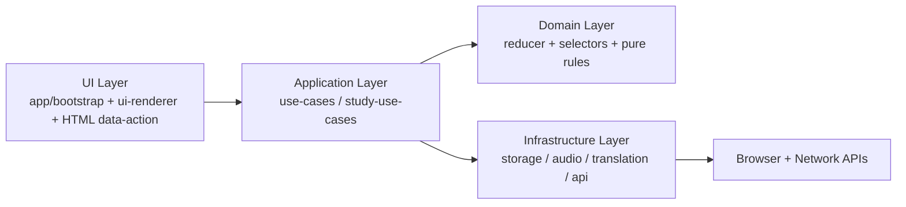

# Vocab Utils JS Architecture

## 1. Scope
This document defines the architecture and extension rules for:
- `/Users/mozhenghong/bowen/user/postgraduate/postgraduate/english/word/utils/js`

Goals:
- High readability
- Clear module boundaries
- Testable business logic
- Minimal coupling to DOM and globals

## 2. Layered Design

Dependency direction (must keep):
1. `app` can depend on `application`, `domain`, `infrastructure`
2. `application` can depend on `domain` and `infrastructure`
3. `domain` depends on nothing outside itself
4. `infrastructure` must not depend on `app` UI code

## 3. Module Responsibilities

### `app/`
- `bootstrap.js`: app startup, event delegation, keyboard bindings
- `vocab-app.js`: application facade and wiring
- `event-handlers.js`: UI event bridge only (delegate workflows to use-cases)
- `ui-renderer.js`: rendering orchestration only
- `state-manager.js`: state persistence + state/session helpers (no DOM rendering)
- `presenters/`: HTML string builders for list/panel rendering
- `renderers/`: DOM rendering modules per UI slice

### `application/`
- Use-case orchestration
- Coordinates multiple modules
- Contains workflow decisions (not DOM-specific)
- `file-use-cases.js`: file browsing/loading/switching workflow

### `domain/`
- Pure business rules
- Reducers and selectors
- Deterministic, side-effect free

### `infrastructure/`
- External side effects:
  - storage
  - audio services
  - translation services
  - API adapters

### `parser/`
- `index.js`: parser entry and object assembly only
- `parse-loop.js`: top-level markdown traversal and list-item dispatch
- `sentence-processor.js`: sentence extraction and promoted child handling
- `children-processor.js`: nested list traversal
- `pending-relations.js`: synonym/antonym/POS/IPA pending-state handling
- `context.js` + `line-utils.js`: parser state and line helpers
- `content-parser.js` + `validators.js` + `rule-engine.js` + `card-builders.js`: pure rule helpers
- Parsing output is a contract; changes require fixture or golden baseline review

## 4. Current Entry Points

Primary UI entry:
- `/Users/mozhenghong/bowen/user/postgraduate/postgraduate/english/word/utils/review.html`
- Loads: `/Users/mozhenghong/bowen/user/postgraduate/postgraduate/english/word/utils/js/app/bootstrap.js`

Parser entry points:
- `MarkdownParser` class
- `parseMarkdownToCards(text)` for tests/automation

Parser regression assets:
- `parser/__tests__/fixtures/`: focused rule fixtures
- `parser/__tests__/golden/`: selected sample snapshots + full corpus hash baselines

## 5. Global State Policy

Allowed:
1. `window.app` only as runtime bootstrap handle

Disallowed:
1. `window._xxx` temporary mutable state
2. Inline HTML event handlers (`onclick="..."`)
3. Business logic in HTML script blocks

## 6. Event and UI Rules

1. All clickable behavior uses `data-action` + delegated listener in `bootstrap.js`
2. `ui-renderer.js` should not call `window.app` directly
3. UI text and templates can be in renderer; business decisions must be in use cases/domain

## 7. State Rules

1. Read state through selectors where possible
2. State transition rules go to reducer/use case
3. Persist via `StorageRepo`, not direct `localStorage` calls

## 8. Module Extension Standards

When adding a new feature, choose the target module using this matrix:

1. Rule computation only: `domain/`
2. Workflow and branching logic: `application/`
3. Network/storage/browser API calls: `infrastructure/`
4. Rendering markup/classes: `app/ui-renderer.js`
5. Input binding (click/key): `app/bootstrap.js`

Required for any new module:
1. Single responsibility (one clear reason to change)
2. Explicit imports (no hidden side effects)
3. Unit tests for domain/application logic
4. No cross-layer reverse dependency

## 9. Review Checklist (Architecture)

Before merge, verify:
1. No new `onclick=` in repo
2. No new `window._` globals
3. No business branching introduced in renderer
4. No direct `localStorage` outside `infrastructure/storage-repo.js`
5. Feature has tests at correct layer

## 10. Roadmap (Next Refactor Targets)

1. Expand parser fixtures for ambiguous edge cases and conflict patterns
2. Convert remaining parser rule branches into smaller named rule modules only when coverage justifies it
3. Optional infra retry/backoff policy if API reliability degrades in production
