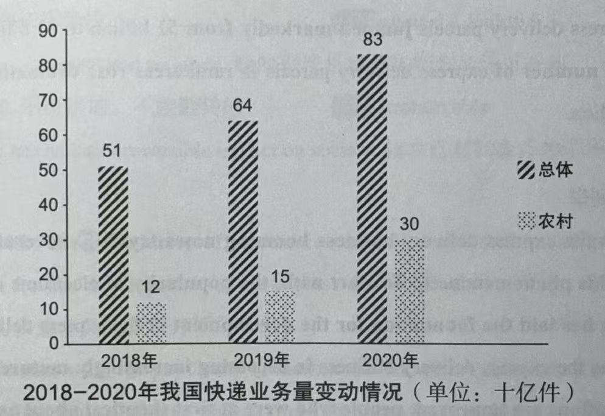

## 041

### Directions

In this section, you are asked to write an essay based on the following chart. In your writing,you should 

1. interpret the chart and
2. give your comments.

### Example

&emsp;&emsp;From the information given in the above column chart, we can see a striking contrast between developing and developed countries in mobile-phone subscriptions from 2000 to 2008. During this period, there has been a dramatic increase from 0.4 to 4 billion mobile-phone subscriptions in developing countries, while those of developed countries remained steady at just under 1 billion. 
&emsp;&emsp;At least two fundamental factors could have contributed to this phenomenon. On the one hand, with the rapid increase in economic development happening in developing countries, the telecommunication industry in those countries has expanded greatly to meet the demand for globalization. As a result, the user base of mobile phones, which can narrow the distance between people and link the whole world together, grew at an astonishing speed. On the other hand, the extremely advanced economy of developed countries means less potential in many aspects and their demand for further enlargement tends to saturate. 
&emsp;&emsp;Although the fact remains that phones are already extremely prevalent in both developing and developed countries, and the growing gap will continue to widen in the future. Therefore, mobile phone manufacturers should pay more attention to the market in developing countries. 

### 译文

&emsp;&emsp;根据上面的柱状图提供的信息，我们可以看出，从2000年到2008年，发展中国家和发达国家在手机入网方面存在着惊人地对比。在此期间，发展中国家手机入网数从4亿急速增长到
40 亿，而发达国家的相关数据在10亿之下保持平稳。 
&emsp;&emsp;至少有两点主要原因造成了这种现象。一方面，随着发展中国家的经济快速增长，这些国家的电信产业大幅扩张以满足全球化的需求。因此，使用手机来缩短人与人之间的距离并与全世界联系的人数以惊人的速度增长。另一方面，发达国家高度发达的经济意味着它们在诸多领域发展潜力较小，他们对进一步开发的需求趋于饱和。 
&emsp;&emsp;尽管手机在发展中国家和发达国家已经非常普遍，但这一差距在未来还会继续扩大。因此，手机制造商应该更加关注发展中国家的市场。

## 042

### Directions

Write an essay based on the following table. In your writing, you should

1) describe the table, and
2) give your comments.

You should write at least 150 words.
Write your essay on ANSWER SHEET 2.

### Example

&emsp;&emsp;The table clearly reflects statistics on staff job satisfaction in a certain company. According to the data given above, we can conclude that the percentage of people satisfied with their jobs is the highest among those over 50 years old, at about 40%. In contrast, the percentage of the staff not satisfied with their jobs is about 64% among those in their forties, the highest among all the three age groups. 
&emsp;&emsp;The major determinant of satisfaction lies in people's attitudes. On the one hand, staff members in their forties usually have to undertake a lot of responsibilities from both their families and their careers. So, they have the lowest level of job satisfaction. On the other hand, people over 50 generally have shifted their life goals from achieving the ultimate success to a relatively easy and comfortable life, and therefore are inclined to be much more satisfied with their jobs. 
&emsp;&emsp;In view of the above reasoning, I am convinced that it is difficult for everyone to be content with their jobs. And it is advisable that people should adjust their expectations for work, and that companies should pay more attention to the welfare of their staff. 

### 译文

&emsp;&emsp;这张表格清楚地反映了某公司员工工作满意度的统计数据。根据给出的数据，我们可以看出50岁以上的人工作满意度最高，约为40%。相反，41岁至50岁之间的人在三个年龄段中不满意度最高，约为 64%。 
&emsp;&emsp;满意度的主要决定因素是人们的态度。一方面，41岁至50岁之间的员工通常不得不承担来自家庭和事业的双重责任。因此，他们对工作的满意度最低。另一方面，50岁以上的人通常已经将人生目标从实现最终的成功转变为过一种相对轻松、舒适的生活，因而更容易对工作感到满意。 
&emsp;&emsp;鉴于上述论证，我认为很难做到每个人都对工作满意。建议人们调整对工作的期望，而企业也应对员工的福利多加重视。

## 043

### Directions

In this section, you are asked to write an essay based on the following chart. In your writing,you should 

1. interpret the chart and
2. give your comments.

### Example

&emsp;&emsp;The pie chart clearly illustrates the purposes of students travelling in a certain university. As is reflected by the diagram, 37 percent of college students travel in order to appreciate the scenery. Next comes the aim of relieving pressure, accounting for 33 percent. By contrast, the percentages of students travelling aiming at other goals, making friends and cultivating independence account for 15%, 9% and 6% respectively.  
&emsp;&emsp;Several primary factors could contribute to this phenomenon. In the first place, travel can offer us a wide range of experiences. While travelling, we may experience the bitterness and joy of people on different lands and in different times. In the second place, college students, who have to juggle academic work, romantic relationships and a busy social calendar, are particularly susceptible to pressure. By touring, they can successfully manage and reduce stress.  
&emsp;&emsp;Taking all these factors into consideration, we may predict that with the quickening pace and ever-increasing pressure of campus life, the number of university students touring will keep growing in the forthcoming decade.

### 译文

&emsp;&emsp;这幅饼状图清楚地揭示了某高校大学生的旅游目的。如图表所示，37%的大学生为了欣赏风景而旅游。接下来是为了缓解压力，占了33%。相比之下，为了其他目的、广交朋友、培养独立能力而旅游的大学生百分比分别占15%、9%和6%。 
&emsp;&emsp;一些主要原因可以解释这种现象。首先，旅游能够充实我们的经历。在旅行中，我们可以体验不同时代、不同国土上人们的酸甜苦辣。其次，大学生不得不应对学习、恋爱和繁忙的社交日程，很容易感受到压力。通过旅游，他们可以成功地应对并缓解压力。 
&emsp;&emsp;考虑到所有这些因素，我们可以预计，随着校园生活节奏的加快和日益增加的压力旅游的大学生数量在未来十年将持续增加。

## 044

### Directions

In this section, you are asked to write an essay based on the following chart. In your writing,you should 

1. interpret the chart and
2. give your comments.

### Example

&emsp;&emsp;The pie chart above clearly reveals the factors of consumers' concern on choosing restaurants in a certain city in 2017. Among all the five categories, the percentages of feature, service and environment are the highest, accounting for 36.3%, 26.8% and 23.8% respectively. On the contrary, the statistics of price and other factors take up merely 8.4% and 4.7% respectively, the lowest among the five groups. 
&emsp;&emsp;Several primary causes that contribute to the above-mentioned phenomenon could be summarized as follows. In the first place, with the prosperity of China's economy and the increase of people's income in recent decades, a large number of people are paying more attention to the feature of a restaurant instead of price. In the second place, in a bid to develop interpersonal relationship and enjoy comfortable life, consumers in mounting numbers prefer service and environment to other factors. 
&emsp;&emsp;With due consideration of all these contributors, we may predict that with the speedy development of our society, customers in expanding numbers will attach utmost significance to the feature, service as well as environment of a restaurant.

### 译文

&emsp;&emsp;上面的饼状图清晰揭示了2017年某市消费者选择餐厅时关注的因素。在所有五组分类数据中，特色、服务、环境的百分比是最高的，分别占36.3%、26.8%和
23.8%。相反，价格和其他因素的数据分别只占8.4%和4.7%，在这五组中是最低的。 
&emsp;&emsp;造成上述现象的几个主要原因可以概括如下。首先，随着中国经济的繁荣和近几十年来人们收人的增加，很多人越来越关注餐厅的特色，而不是价格。其次，为了拓展人际关系，享受舒适的生活，越来越多的消费者更注重服务与环境，而非其他因素。 
&emsp;&emsp;充分考虑到所有这些因素，我们可以预计，随着社会的迅速发展，越来越多的消费者将非常重视餐厅的特色、服务及环境。

## 045

### Directions

In this section, you are asked to write an essay based on the following chart. In your writing,you should 

1. interpret the chart and
2. give your comments.

### Example

&emsp;&emsp;The bar chart above illustrates the results of a survey on the types of exercise among residents in a certain city. According to the data given above, the percentage of people exercising alone accounts for 54.3%, the highest among the four categories. The percentages of people exercising with friends, family and by taking part in group activities take up 47.7%, 23.9% and 15.8% respectively. 
&emsp;&emsp;Several factors that account for the above-mentioned phenomena could be summarized as follows. To start with, the main reason for sports and exercise is to encourage a healthy lifestyle. Exercising and playing sports can have huge benefits for a person's strength, agility, figure and mental well-being. Furthermore, exercising with friends and family could instill the values of teamwork and sportsmanship. Exercising in general, whether individual or team-based, can teach people how to be sportsmanlike in competitive circumstances.  
&emsp;&emsp;To sum up, by fostering enthusiasm for sports and exercise, society can ensure a generation of healthy and sportsmanlike citizens.

### 译文

&emsp;&emsp;上述的柱状图清楚地展现了针对某市居民体育锻炼方式的调查。根据上图中给出的数据，独自锻炼的人占
54.3%，在这四类中占比最大。和朋友一起、和家人一起以及通过参加团体活动进行锻炼的人分别占 47.7%、23.9% 和 15.8%。 
&emsp;&emsp;造成上述现象的一些因素可以概括如下。首先，人们进行体育锻炼的主要原因在于它能够鼓励人们保持健康的生活方式。体育锻炼和进行体育活动能在体能、灵活性、身材以及心理健康方面给人带来很大的好处。此外，和朋友、家人一起锻炼能够灌输团队合作和体育精神的价值观。一般来讲，无论是个人项目，还是团队项目，体育锻炼都能够教会人们在竞争的环境中如何具备运动员精神。 
&emsp;&emsp;总之，通过培养对体育锻炼的热情，社会能培养出一代身体健康而又具备体育精神的公民。

## 046

### Directions

In this section, you are asked to write an essay based on the following chart. In your writing,you should 

1. interpret the chart and
2. give your comments.

### Example

&emsp;&emsp;As can be seen from the bar chart above, the express delivery business in China has increased considerably between 2018 and 2020. During this three-year period, the total number of express delivery parcels jumped markedly from 51 billion to 83 billion. In the meantime, the number of express delivery parcels in rural areas rose dramatically from 12 billion to 30 billion. 
&emsp;&emsp;Why is the express delivery business booming nowadays? Several factors may contribute to this phenomenon. To start with, the popularity of electronic commerce and online shopping has laid the foundation for the development of the express delivery business. Moreover, as the express delivery business is becoming increasingly mature and relevant laws and regulations are improved, people who were at first skeptical about express delivery service now become convinced that it is safe and reliable. 
&emsp;&emsp;The boom of the express delivery business undoubtedly contributes to the prosperity of China's economy. Accordingly, let us get prepared to embrace this irreversible trend.

### 译文

&emsp;&emsp;从上面的柱状图可以看出,从2018年到2020年,中国快递业务大幅增长。在这三年间快递包裹总件数从510亿激增至830亿。与此同时，农村地区的快递包裹总件数从
120亿跃升至 300亿。 
&emsp;&emsp;为什么如今快递业务发展得如此之快呢?可能有几个因素促成了这个现象。首先，电子商务和网上购物的普及为快递业务的发展打下了基础。其次，随着快递业务日趋成熟以及相关法律法规的完善，起初对快递持怀疑态度的人现在也已经相信快递是安全可靠的。 
&emsp;&emsp;快递业务的迅速发展无疑为中国经济的繁荣做出了贡献。因此，让我们准备好欣然接受这一不可逆转的趋势吧。

## 047

### Directions

In this section, you are asked to write an essay based on the following chart. In your writing, you should 

1. interpret the chart and
2. give your comments.

### Example

&emsp;&emsp;The diagram above clearly illustrates that a dramatic increase has occurred in the recruitment of Masters of Engineering(ME) in China during the past seven years. In 1998, the number was at a low of only about 2,500. Surprisingly, it reached more than 35,000 in 2004, within no more than seven years.  
&emsp;&emsp;Some driving factors that contribute to the above-mentioned change may be summarized as follows. First and foremost, China has become particularly active in manufacturing, which has led to an increased demand for qualified engineers. In addition, the development of the job market on the whole cannot keep pace with the expansion of college graduates, which has obliged a large number of students to stay on campus for another three years to get better prepared for their careers. 
&emsp;&emsp;It is necessary for us to take effective measures to ensure this situation doesn't get out of hand, and encourage students to choose majors for which both theoretical knowledge and practical skills will be demanded in the job market. 

### 译文

&emsp;&emsp;上面的图表清楚地揭示了过去七年中国的工程硕士招生录取人数急剧增长。1998
年招生人数较少，只有大约2500人。令人惊讶的是，到2004年，招生人数在不到七年的时间里达到了 3.5 万人以上。 
&emsp;&emsp;促成上述变化的一些驱动因素可以概括如下。首先,中国在制造业方面变得异常活跃这使得对高素质工程师的需求增加。此外，就业市场的总体发展无法跟上大学毕业生人数的增加，这促使很多学生在校园里再待三年时间，为就业做更好的准备。 
&emsp;&emsp;我们必须采取有效措施确保这一状况不会失控，同时鼓励学生选择那些就业市场上需要的既有理论知识又有实践技能的专业。

## 048

### Directions

In this section, you are asked to write an essay based on the following chart. In your writing, you should 

1. interpret the chart and
2. give your comments.

### Example

&emsp;&emsp;The picture vividly depicts a lovely American girl in traditional Chinese costume with a sweet smile on her face. She wears ribbons, necklaces and other accessories that are characteristic of the clothes of a certain Chinese minority group. Undoubtedly, the costume has added oriental charm to her beautiful features. 
&emsp;&emsp;The fact that people from different countries are attracted to the mysterious Chinese culture indicates that to some extent a culture can be accepted, respected, appreciated and shared internationally. In other words, a nation's unique culture can become international through worldwide economic and cultural exchanges. Since the trend of globalization has become irresistible, increasingly frequent cultural exchanges can effectively improve mutual understanding and friendship between countries. 
&emsp;&emsp;It is my view that national culture should be preserved and cherished as a priceless spiritual treasure. Nevertheless, when we are confronted with a different culture, we should be sensible enough to absorb its virtues and to resist its dark side. Only in this way can we promote culture development positively and make our world multidimensional, colorful and vigorous.

### 译文

&emsp;&emsp;这幅图画生动地描绘了一位可爱的美国女孩，她身穿传统的中式服装，面带甜美的微笑。她戴着具有中国某个少数民族服饰特色的发带、项链和其他饰品。毫无疑问，这套服装为她美丽的外表增添了东方的魅力。 
&emsp;&emsp;神秘的中国文化吸引了各国人民这一事实表明，在某种程度上一种文化可以在国际范围内被接受、尊重、欣赏和分享。换言之，一个国家独特的文化可以通过全球性的经济和文化交流走向世界。由于全球化潮流已经不可阻挡，所以日益频繁的文化交流可以有效地增进国家之间的相互理解和友谊。 
&emsp;&emsp;在我看来，我们应该保护和珍惜作为无价的精神财富的民族文化。不过，我们在面对不同文化时，应该足够理智地取其精华、去其糟粕。只有这样我们才能积极推动文化发展使我们的世界丰富多元、多姿多彩、充满活力。

## 049

### Directions

In this section, you are asked to write an essay based on the following chart. In your writing,you should 

1. interpret the chart and
2. give your comments.

### Example

&emsp;&emsp;It is symbolically illustrated in the cartoon that a striker is preparing to shoot at the goal defended by a
goalkeeper on a footer field. In the goalkeeper's mind, he is so much smaller than he actually is that guarding the goal
becomes an impossible mission. At the same time, the giant guard seems to fill up the whole goal in the attacking
player's mind. 
&emsp;&emsp;The purpose of the drawing is to show us that in the face of seemingly insurmountable challenges or
predicaments, possessing self-confidence is of the utmost significance. Regardless of how much success one has had in
school or at work, there are bound to be times when he or she will encounter problems. It is at these critical times
that one's self-confidence, toward difficulty and toward life in general, plays a crucial role in determining whether he
or she can turn failure into victory. 
&emsp;&emsp;I can think of no better illustration than the following one. Helen Keller was deaf and blind, certainly
nothing to give her self-confidence. Nevertheless, she went on to conquer her multiple handicaps to finally become a
writer and lecturer, and an inspiration to all. This case effectively illustrates that no matter what tasks we are
confronted with, we should never overestimate the difficulties or underestimate our abilities.

### 译文

&emsp;&emsp;这幅漫画具有象征意味地展示了足球场上的一名前锋正准备将球射入守门员把守的球门。守门员把自己想得比实际的身材渺小得多，以至于守门变成了一项不可能完成的任务。与此同时，在那名前锋看来，这位巨人守门员似乎占据了整个球门。 
&emsp;&emsp;这幅漫画的目的是告诉我们，在看似不可克服的挑战与困境面前，最重要的是拥有自信。无论一个人在学校或工作中曾经如何成功，总有一天他或她会遭遇难题。关键时刻，正是一个人对困难和人生的自信决定他或她能否反败为胜。 
&emsp;&emsp;没有什么比下面的例子更有说服力。海伦·凯勒失去了听力和视力，没什么可以让她自信。但她不断克服多重障碍，最终成为一名作家和教师，成为世人的楷模。这个例子清楚证明了无论面临何种任务，我们决不能高估困难或低估自己的能力。

## 050

### Directions

&emsp;&emsp;Read the following excerpt from an article and write an essay. In your essay, you should explain whether or to what extent you agree with the author. Support your argument with reasons and relevant examples.
&emsp;&emsp;Write your answer in about 150 words on the ANSWER SHEET.

&emsp;&emsp;Studies in the U.S. and the U.K. consistently show that children have lost the right to wander. This is why
many of our youth turn to technology. They aren't addicted to the computer,they're addicted to interaction, and being
around their friends. Children, and especially teenagers,don't want to only socialize with parents and siblings, they
want to play with their peers. That's how they make sense of the world. And we've robbed them of that opportunity. We're
raising our children in captivity and they turn to technology to socialize, learn and relax. Why are we blaming the
screens?

### Example

&emsp;&emsp;Nowadays, a large number of teenagers have lost the right to play outside and instead indulge in computer use. In this excerpt, the author maintains that since parents have robbed their children of the opportunity to wander around, a good many youngsters use the computer to socialize with their friends. I agree with the writer's idea. 
&emsp;&emsp;The primary factors that account for the aforementioned phenomenon can be summarized as follows. On the one hand, school time can be a period of constant pressure for students. Stressors like upcoming examinations and endless assignments take up most of their life, leaving them less and less time for free play. On the other hand, in order not to let their children lose at the so-called starting line, many parents force their children to attend various cram schools and interest classes, depriving them of the right to play with their peers. Therefore, many teenagers indulge in the fictitious world and feel reluctant to approach others. 
&emsp;&emsp;Hence, parents should be sensible enough to give their children more freedom to play with their friends and classmates. Meanwhile, it is necessary for teenagers to use technology in a reasonable way and refrain from overindulgence.

### 译文

&emsp;&emsp;现在，很多青少年都丧失了外出玩耍的权利并沉迷于电脑。在这篇选段中，作者认为由于父母剥夺了孩子们四处闲逛的机会，所以很多青少年使用电脑来和朋友们社交。我同意作者的观点。 
&emsp;&emsp;造成上述现象的主要因素可以概括如下。一方面，学生时代对学生而言是一个压力不断的时期。即将来临的考试和无尽的作业等压力源占据了他们生活的大部分时间，他们可以自由玩耍的时间变得越来越少。另一方面，为了不让孩子输在所谓的起跑线上，很多父母强迫孩子上各种补习班和兴趣班，剥夺了他们与同龄人玩耍的权利。因此，很多青少年沉迷于虚幻世界，不愿意与他人接近。 
&emsp;&emsp;因此，父母应该足够理智，给孩子们更多自由去和朋友、同学玩耍。同时，青少年应该合理使用科技，避免过度沉迷。

## 051

### Directions

Write an essay based on the chart. In your essay, you should

1. describe and interpret the chart, and
2. give your comments.

### Example

&emsp;&emsp;The column chart above clearly illustrates the operation mileage of high-speed railway in China between 2016
and 2023. According to the diagram, between 2016 and 2017, the operating railway lines increased slightly from 22000
kilometers to 25000 kilometers, a rise of merely 3000 kilometers. By contrast, it jumped markedly from 25000 kilometers
to 45000 kilometers between 2017 and 2023, an increase of 20000 kilometers within six years. 
&emsp;&emsp;The high-speed rail has significantly changed the lives of Chinese people. To begin with, it has driven the
development of short-term tourism and economic prosperity. In addition, it allows passengers to shuttle between various
major cities in China in one day. Last but not least, it enables people to pursue job opportunities across different
provinces. 
&emsp;&emsp;Given all the arguments above, we may come to the conclusion that with the speedy development of economy,
the mileage of high-speed railway in China will keep growing in the forthcoming decade.

### 译文

&emsp;&emsp;上面的柱状图清晰地展示了2016年至2023年间中国高铁的运营里程情况。根据该图表，从2016年至2017年，运营里程从2.2万公里小幅增长至2.5万公里，只增长了3千公里。相比之下，从2017年到2023年，运营里程从2.5万公里大幅增加至4.5万公里，在六年的时间内增长了2万公里。 
&emsp;&emsp;高铁极大地改变了中国人的生活。首先，它带动了短期旅游的发展,从而促进了经济繁荣。其次，它可以让旅客在一天内在中国多个大城市间穿梭。最后但同样重要的是，它使人们能够在不同省份之间寻找工作机会。 
&emsp;&emsp;鉴于上述所有论点，我们可以得出结论:随着经济的迅猛发展，中国高铁里程在未来十年将继续增长。

## 052

### Directions

Write an essay on the chart. In your essay, you should

1. describe and interpret the chart, and
2. give your comments.

### Example

&emsp;&emsp;What is shown in the chart above indicates that by the end of 2023, the ownership of New Energy Vehicles(
NEVs) in China reached 20.41 million. In the meantime, the newly registered NEVs throughout the year in China got to
7.43 million. 
&emsp;&emsp;Why are NEVs booming nowadays? Several factors bring about this phenomenon. To begin with, the promotion of
NEVs is an effective practice to ease impending energy shortages. It is universally acknowledged that we are likely to
face a global energy shortage over the next few decades. More importantly, one significant benefit of developing NEVs is
that can help to curb the problem of air pollution and thus promote a cleaner and greener environment. Last but not
least, the NEV industry is regarded as a backbone, or key industry, acting as an engine of and supporting many
subsidiary industries, such as steel, machinery, glass, rubber, tires, paints, and so on 
&emsp;&emsp;Generally speaking, NEVs are an irresistible historical trend and a fashion, which we should embrace without
hesitation.

### 译文

&emsp;&emsp;上面的图表显示，到 2023年底，我国新能源汽车保有量达到了2041万辆。与此同时全年新登记注册的新能源汽车达 743
万辆。 
&emsp;&emsp;为什么如今新能源汽车发展如此迅猛?一些因素造成了这一现象。首先，推广新能源汽车是缓解迫在眉睫的能源短缺问题的一个有效做法。众所周知，未来几十年，我们很可能会面临世界能源短缺问题。更重要的是，发展新能源汽车的一个重大好处就是它们有助于遏制空气污染问题，从而促进形成更加清洁、环保的环境。最后但同样重要的是，新能源汽车产业被视为一大支柱产业或关键产业，带动并支持着钢铁、机械、玻璃、橡胶、轮胎、涂料等许多辅助产业的发展。 
&emsp;&emsp;总之，新能源汽车是不可阻挡的历史潮流，是一种时尚，我们应该毫不犹豫地接受它。 

## 053

### Directions

Write an essay on the chart. In your essay, you should

1. describe and interpret the chart, and
2. give your comments.

### Example

&emsp;&emsp;The pie chart above clearly reveals the results of a survey on the average times of consumers' ordering
takeaway per month in China in 2021. According to the data, the percentage of ordering takeaway from one to five times
is the largest among the five groups, accounting for 35.2%; the percentage of ordering takeaway from six to ten times is
27%. In contrast, the percentage of never ordering takeaway merely takes up 18.5%. 
&emsp;&emsp;Primary factors that result in the phenomenon may be summarized as follows. To begin with, with the
quickening pace of urban life and ever-increasing work pressure in recent years, a good many people prefer ordering
takeaway to going to a restaurant. In addition, in a bid to enjoy a comfortable life, instead of cooking by themselves,
consumers in mounting numbers are willing to order takeaway in companies or at home. Lastly, the prosperous takeaway
industry can be ascribed to the speedy development of online shopping and express delivery business. 
&emsp;&emsp;Briefly speaking, the booming takeaway industry undoubtedly contributes to the prosperity of the
economy. 

### 译文

&emsp;&emsp;以上饼状图清楚地显示了2021年中国消费者月均点外卖次数的调研结果。根据数据，在这五组中，点外卖1-5次的人数在这五组中占比最大，占35.2%;点外卖6-10次的人数占比为
27%。相比之下，从来不点外卖的人仅占18.5%。 
&emsp;&emsp;造成上述现象的主要原因如下。首先，随着近年来都市生活节奏的加快以及工作压力的不断增加，比起去餐馆，很多人更喜欢点外卖。其次，为了享受舒适的生活，越来越多的消费者喜欢在公司或家里点外卖，而不是自己做饭。最后，繁荣的外卖行业应该归功于网上购物和快递产业的迅猛发展。 
&emsp;&emsp;简言之，快速发展的外卖行业无疑有助于经济的繁荣。 

## 054

### Directions

Write an essay on the chart. In your essay, you should

1. describe and interpret the chart, and
2. give your comments.

### Example

&emsp;&emsp;The diagram above clearly reflects that China has made tremendous achievements in poverty alleviation from
2012 to 2020. During this period, China's impoverished rural population decreased considerably from nearly 100 million
to nearly zero, a decline of 100 million. At the same time, the poverty headcount ratio also fell from approximately 10%
to almost 0%. 
&emsp;&emsp;Several primary factors for the above-mentioned changes can be summarized as follows. To begin with, the
relevant authorities in China have adopted a combination of conventional and innovative approaches to improve rural
education and healthcare. What is more, China has put great emphasis on the establishment of infrastructure in poor
rural areas, which has effectively bridged the gap between the rich and the poor. Last but not least, these achievements
can be attributed to China's speedy economic development during the past several decades. 
&emsp;&emsp;In short, China's poverty alleviation campaign is vital both nationally and internationally. To start with,
anti-poverty achievements have allowed more people to enjoy the advantages of China's economic boom. What is more, the
Chinese government has fulfilled its promise of lifting all its citizens out of poverty. 

### 译文

&emsp;&emsp;上面的图表清楚地揭示了2012年到2020年间中国在扶贫方面取得的巨大成就。在此期间中国的农村贫困人口数量从大约1亿大幅减少到几乎为零，减少了近1亿。与此同时，农村的贫困人口比例从大约
10%下降到几乎为零。 
&emsp;&emsp;促成上述变化的主要因素可以概括如下。首先，中国相关部门结合传统方法和创新方法，帮助改善了农村地区的教育和医疗水平。其次，中国非常重视农村贫困地区的基础设施建设，有效缩小了贫富差距。最后但同样重要的是,这一成就可以归功于过去几十年中国经济的快速发展。 
&emsp;&emsp;总之，中国的扶贫战役对本国和世界都极为重要。首先，反贫困的成就让更多的人享受到中国经济繁荣的好处。更重要的是，中国政府已经实现了全民脱贫的承诺。 

## 055

### Directions

Write an essay on the chart. In your essay, you should

1. describe and interpret the chart, and
2. give your comments.

### Example

&emsp;&emsp;The column chart demonstrates the Gross Merchandise Volume(GMV) of live broadcasting electronic commerce in
China from 2017 to 2024. Between 2017 and 2019, the GMV increased mildly from RMB 16.8 billion to 416.8 billion, a rise
of 400 billion yuan. By contrast, it jumped considerably from RMB 416.8 billion to 5316.6 billion from 2019 to 2024. 
&emsp;&emsp;The booming of live broadcasting exerts a profound influence on our society. On the one hand, China is
witnessing the Internet swarming with wanghong, the grass-root Internet celebrities who win nationwide popularity by
pulling stunts. As a result, a large number of consumers are willing to shop online via the live broadcasting of these
anchors, which promotes the development of economy. On the other hand, some behaviors of a good many live broadcasting
anchors convey wrong values to customers and teenagers. Some anchors attract their followers by dishonest words and
false promises. This will undeniably shape the customers' values in a negative way. 
&emsp;&emsp;In sum, I cling to the idea that live broadcasting is a double-edged sword, which exerts both positive and
negative effects on consumers and society.

### 译文

&emsp;&emsp;这个柱状图显示了2017年至2024年中国直播电商的商品交易总额规模。从2017年到2019年，商品交易总额从168亿元温和增长到4168亿元，增长了4000亿元。相比之下，从2019
年到 2024 年，商品交易总额从 4168 亿元大幅增长到 53166 亿元。 
&emsp;&emsp;直播的繁荣对我们的社会产生了深远的影响。一方面，中国的社交网络涌现出越来越多的网红，这些来自草根阶层的网络名人通过大搞噱头成功地在全国受到追捧。因此，很多消费者愿意通过这些主播的直播进行网上购物，这促进了经济的发展。另一方面，很多直播主播的一些行为会给消费者和青少年传达错误的价值观。一些主播靠谎言和虚假地承诺吸引自己的粉丝。不可否认的是，这会对消费者的价值观造成负面的影响。 
&emsp;&emsp;总之，我认为直播是一把双刃剑,既会对消费者和社会造成积极影响,也会造成负面影响。

## 056

### Directions

Write an essay on the chart. In your essay, you should

1. describe and interpret the chart, and
2. give your comments.

### Example

&emsp;&emsp;It is apparent from the table above that the total revenue of the tourist industry has reached 2.5 trillion
RMB in 2015, at a growth rate of 10% per year. From the statistics given in the table, we can see that the value added
in tourism has accounted for 4.5% of national GDP and 12% of the value added in the service sector. 
&emsp;&emsp;Many countries are striving to develop their national tourism because it really has a lot of advantages.
First and foremost, travel provides many opportunities to promote exchanges among people from diverse cultural
backgrounds. For instance, since the reform and opening-up, China, a country which has rich tourism resources, receives
millions of foreign tourists every year. Moreover, travel increases one's knowledge, widens one's horizons and enhances
mutual understanding. Finally, tourism boosts local economy and promotes commercial exchanges. 
&emsp;&emsp;In my opinion, we should make good use of rich tourism resources to make our motherland more beautiful.

### 译文

&emsp;&emsp;由上面的图表不难得知，2015年，旅游业年总收入已达到2.5万亿元，年均增长10%。从图表中给出的数据，我们可以看出，旅游业增加值占全国GDP的比重为4.5%，占服务业增加值的比重为12%。 
&emsp;&emsp;由于旅游业确实有很多优点，很多国家都在努力发展本国旅游业。首先且最重要的是旅游为促进不同文化背景之间人们的相互交流提供很多机会。例如，改革开放以来，作为-个拥有丰富旅游资源的国家，中国每年都接待数以百万计的外国游客。此外，旅游可以增长人们的知识，开阔人们的视野，并增进人们之间的相互理解。最后，旅游业带动了地方经济的发展并促进了商业交流。 
&emsp;&emsp;在我看来，我们应该充分利用丰富的旅游资源，使我们的祖国变得更加美好。 

## 057

### Directions

Write an essay on the chart. In your essay, you should

1. describe and interpret the chart, and
2. give your comments.

### Example

&emsp;&emsp;The line chart above clearly illustrates the number of gymnasiums and people doing exercise in a certain
city between 2014 and 2016. As is revealed in the graph, the number of people doing exercise have been on a steady rise,
from one million to nearly two million, while the number of gyms has increased considerably from 600 to about 860, a
rise of about 260. 
&emsp;&emsp;Several factors could contribute to this tendency. In the first place, with the quickening pace and
ever-increasing pressure of urban life, people in growing numbers are suffering either physical or mental problems.
Thus, gymnasiums in mounting numbers have been built by concerned departments. In the second place, the desire for good
health is universal. Accordingly, people choose jogging, playing basketball, swimming, skating, climbing or riding
respectively as their regular exercise because exercise never fails to make them stronger and more energetic. 
&emsp;&emsp;As far as I am concerned, an hour's exercise every day usually makes me feel healthier and more vigorous.
Besides, I keep a balanced diet and go to bed before 11 o'clock at night. To sum up, all these practices guarantee a
healthy body and a happy life. 

### 译文

&emsp;&emsp;上面的线状图清晰地显示了某市2014年至2016年体育馆的数量和锻炼人数。如该图所示锻炼人数从一百万人稳步增加到近两百万人,同时,体育馆数量从600座急剧增加到约860座，增长了约260座。 
&emsp;&emsp;几个因素促成了这一趋势。首先，随着都市生活节奏的加快和压力的不断增加，越来越多的人开始面临生理或心理问题。因此，相关部门建造了越来越多的体育馆。其次，对于健康地渴望很普遍。因此，人们各自选择慢跑、打篮球、游泳、滑冰、爬山或骑车作为日常锻炼方式，因为运动总能使他们更强壮、更精力充沛。 
&emsp;&emsp;就我而言，每天一小时的锻炼通常使我感到更健康而且更有活力。此外，我保持均衡饮食，而且晚上11点之前上床睡觉。总之，所有这些做法可以保证我拥有健康的体魄和快乐的生活。

## 058

### Directions

Write an essay on the chart. In your essay, you should

1. describe and interpret the chart, and
2. give your comments.

### Example

&emsp;&emsp;It is subtly illustrated in the portrayal on the left that a foreign lady is pleasantly appreciating a
traditional Chinese vase in a museum. Obviously, she has been attracted by its elegant charm. The column chart on the
right clearly reveals that between 2010 and 2024, the number of Chinese Peking Opera troupes performing abroad rose
dramatically from 100 to 550, an increase of 450. 
&emsp;&emsp;In my opinion, traditional Chinese culture is not only certain to survive, but is, in fact, destined to
thrive and prosper. One factor that has already begun to contribute to the preservation of traditional Chinese culture
is its commercialization. Another reason that the future of China's traditional culture can be considered "safe" is the
active efforts to protect it on the part of the Chinese government. Finally, the traditional culture of China is
supported by widespread and growing international interest in China and its traditions. 
&emsp;&emsp;For China, as any other rapidly developing country, there is a danger that age-old customs and traditions
may become lost in the shadow of modernization. Fortunately, as a result of successful commercialization efforts,
unwavering government support and growing interest overseas, the future of China's traditional culture seem brighter and
more secure than ever before.

### 译文

&emsp;&emsp;左侧的图画巧妙地展示了一位外国女士正在博物馆中愉快地欣赏一个中国传统花瓶。显然，女士被它优雅的魅力所吸引。右侧的柱状图清晰地显示了在2010年到2024年之间，中国京剧团体出国演出场次从100场急剧增加到550场，共增加了450场。 
&emsp;&emsp;在我看来，中国传统文化不但肯定能够存续，而且事实上必将会繁荣兴盛。首先，已经开始对保护中国传统文化做出贡献的一个因素是其自身的商业化。其次，中国传统文化的未来可被视为“安全”的另一个原因是中国政府在保护文化方面做出了积极努力。最后，随着国际上对中国及其传统广泛且越来越浓厚的兴趣，中国传统文化得到了国际上的支持。 
&emsp;&emsp;中国跟世界上其他快速发展的国家一样，古老的习俗和传统在现代化的阴影下面临着消失的危险。但幸运的是，由于成功的商业努力、政府坚定不移的支持和不断增长的来自海外的兴趣，中国传统文化的未来似乎比过去任何时候都更光明、更安全。

## 059

### Directions

Write an essay on the chart. In your essay, you should

1. describe and interpret the chart, and
2. give your comments.

### Example

&emsp;&emsp;In the picture above are two lovely college students. The young man on the left asks the beautiful girl on
the right why she decides to pursue a master's degree after college. The girl answers confidently, "with a master's
degree, there will be many more desirable choices!" 
&emsp;&emsp;There are many reasons for my decision to attend a postgraduate program. The primary one is that I enjoy
learning and acquiring knowledge. The decision was naturally made when I realized I would not be content to simply end
my formal education with college level and enter society so soon. I decided to stay on the academic assembly line also
because of the value of a master's degree. In today's world, in which the college population has been growing rapidly, a
master's degree becomes essential to compete for a well-paid job. 
&emsp;&emsp;For these reasons, I won't mind spending another three years in the ivory tower, I won't regret giving up
immediate opportunities to make money; and I won't regret sacrificing many beautiful things in the period of my
life. 

### 译文

&emsp;&emsp;上幅图中有两名可爱的大学生。左边的男生问右边的漂亮女生为什么决定大学毕业之后攻读硕士学位。女孩自信地回答:
“考研之后，会有更多更好的选择空间。” 
&emsp;&emsp;有很多理由促使我决定攻读硕士学位。最主要的一个原因是我喜欢学习，乐于追求知识。当我意识到我不会甘心大学毕业就结束我的正规教育，这么早就踏人社会时，决定就自然形成了。我决定继续留在大学里，还因为硕士学位的价值。当今社会，大学生人数一直在快速增长，要找到一份报酬不错的工作，硕士学位就变得十分必要。 
&emsp;&emsp;正因为这些理由，我不介意再在大学里待上三年时间，不后悔放弃眼前的赚钱机会，也不后悔牺牲我这个年龄段许多美好的东西。 

## 060

### Directions

&emsp;&emsp;Read the following excerpt from an article and write an essay. In your essay, you should explain whether or
to what extent you agree with the author, Support your argument with reasons and relevant examples.

&emsp;&emsp;Changing technology stimulates the brain and increases intelligence, But that may only be true if technology
challenges us. In a world run by intelligent machines, our lives could geta lot simpler, Would that make us less
intelligent? Artificial intelligence is taking over many human jobs. For instance, planes are being flown much of the
time by automatic pilots. And the complex problem of controlling air traffic around large modern airports is also
achieved by artificial intelligence that operates well beyond the capability of mere human air traffic controllers,
Artificial intelligence is embedded in many features of modern life for a simple reason that intelligent machines can
already outperform humans, including some aptitudes where there was once thought to be a human advantage, such as
playing chess, and writing poetry, or even novels 
&emsp;&emsp;As machines get smarter, they will do more of our thinking for us and make life easier.In the future, the
electronic assistant will develop to the point that it serves similar functions as a real living butler, fulfilling
requests such as: "Organize a dinner party for six on Thursday, and invite the usual guest." At that point, our long
struggle with challenging technologies is at an end. We can take it easy knowing that the hard work of planning and
organizing is being done by a better brain-the electronic assistant. Starved with mental effort, our brains well
regress.

### Example

&emsp;&emsp;Currently, great achievements have been made in the field of artificial intelligence, which is taking over a
good number of human jobs. In this excerpt, the author assumes that since artificial intelligence can plan and organize
for us, our brains will regress. I disagree with the author's opinion. 
&emsp;&emsp;I cling to the idea that even if intelligent machines are getting increasingly smarter, our world will never
be like a scene from science fiction in which human brains are inferior. To begin with, no matter how superior its
abilities are in certain areas, artificial intelligence needs us just as much as we need it. In other words,
computer-based artificial intelligence has to rely on humans for maintenance to ensure its existence. What is more,
face-to-face interactions between humans can never be replaced by machines. Intelligent machines are unlikely to develop
human-like social competence, which requires empathy, sensitivity to tone, etc. 
&emsp;&emsp;To sum up, concern about whether artificial intelligence will make our brains regress is caused by an
overestimation of the impact of technology on humans.

### 译文

&emsp;&emsp;目前，人工智能领域已取得了巨大成就，人工智能正在接管很多人类所从事的工作。在这篇选段中，作者认为我们的大脑会退化，因为人工智能会为我们计划和组织工作。我不赞同作者的观点。 
&emsp;&emsp;我坚持认为，尽管智能机器正在变得越来越智能化，但我们的世界永远不会像科幻小说的场景中那样，人脑比不上智能机器。首先，不管智能机器的能力在某些领域有多高级，人工智能对我们的需要跟我们对它的需要一样多。换言之，以计算机为基础的人工智能不得不依赖人类的维护才能确保自身的存在。其次，机器永远不可能替代人与人之间面对面的互动。智能机器不太可能发展出像人类一样的社交能力，这需要同理心、对语气的敏感度等。 
&emsp;&emsp;综上所述，对于人工智能是否会造成我们大脑退化的担忧，是因为高估了技术对人类的影响。
